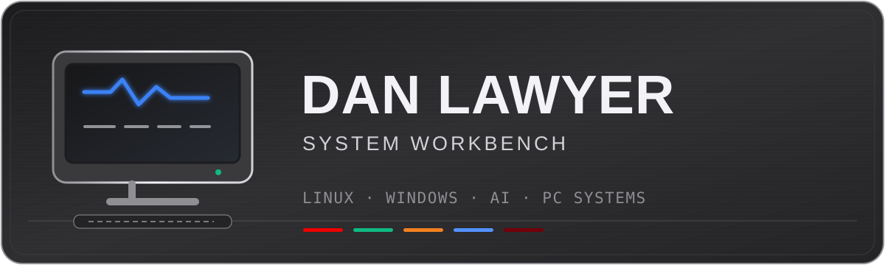
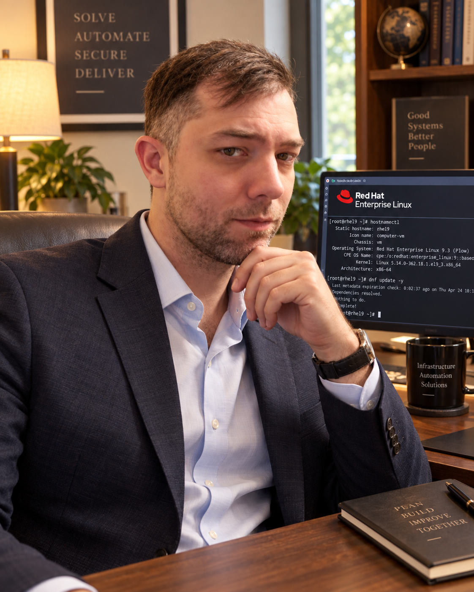
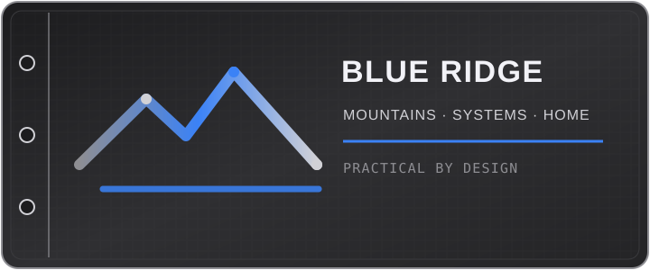
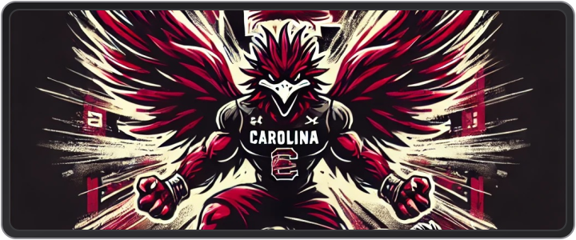

 

# Dan Lawyer

### Linux · Windows · AI · PC Systems

*Building skills back one system at a time.*

 

 

<table>
  <tr>
    <td width="50%" align="center">
      
    </td>
    <td width="50%" align="center">
      
    </td>
  </tr>
</table>

## About Me

I'm building this GitHub as a home for the systems, scripts, containers, and lab work that help me keep learning and growing in IT.

My current focus includes Red Hat Enterprise Linux, Rocky Linux, Windows 11, Windows Server 2025, PowerShell, Cloudflare, Tailscale, AI tools, and PC gaming systems.

This is where I document what I'm learning, keep useful tools close at hand, and organize the projects that help me stay hands-on with technology.

## Core Focus Areas

| Workbench | What I'm exploring |
|---|---|
| **Linux systems** | RHEL and Rocky Linux administration, workstation setup, services, and troubleshooting |
| **Windows systems** | Windows 11, Windows Server 2025, PowerShell, maintenance, and repeatable setup |
| **Connected lab** | Tailscale networking, Cloudflare services, remote access, and practical security |
| **Compute and AI** | Local AI tools, containers, GHCR workflows, and gaming PC hardware |

## Linux

Linux is a central part of my learning lab. I'm using [Red Hat Enterprise Linux](linux/rhel/) and [Rocky Linux](linux/rocky/) to practice installation, system administration, updates, services, networking, and troubleshooting. Working notes and commands belong in [linux/notes](linux/notes/).

## Windows

My Windows work covers daily desktop use and server administration. The [Windows area](windows/) keeps PowerShell tools, Windows 11 setup notes, Windows Server 2025 experiments, and practical fixes organized by platform.

## Networking & Cloud

I'm learning how systems connect securely on a real network—not only how they work in isolation. The [networking lab](networking/) is for Cloudflare configurations, Tailscale mesh networking, remote-access patterns, diagrams, and troubleshooting notes.

## AI & Learning Lab

The [AI lab](ai-lab/) is a place to explore local models, inference tools, hardware limits, and useful AI-assisted workflows. The goal is to record what works, what does not, and what I learn while testing it.

## Gaming PC

PC gaming is also a hands-on systems lab. The [gaming PC section](gaming-pc/) covers builds, upgrades, driver and performance notes, cooling, stability, peripherals, and sensible tweaks that can be repeated or reversed.

## Containers / GHCR

The [containers section](containers/) is for container build notes, image usage, registry workflows, and reproducible run examples.

> **Add verified GHCR package links here.**

Package links will only be added after their names, visibility, and ownership have been confirmed.

## What Lives Here

- Setup notes that turn a successful experiment into a repeatable process
- PowerShell and shell scripts that solve practical workstation or lab problems
- Container recipes and verified GHCR usage notes
- Quick starts for tools I want to be able to revisit later
- Reference material, troubleshooting records, and lessons learned

## Repository Sections

| Section | Purpose |
|---|---|
| [`linux/`](linux/) | RHEL, Rocky Linux, and Linux system notes |
| [`windows/`](windows/) | PowerShell, Windows 11, and Windows Server 2025 |
| [`networking/`](networking/) | Cloudflare, Tailscale, and network notes |
| [`ai-lab/`](ai-lab/) | Models, tools, experiments, and learning notes |
| [`gaming-pc/`](gaming-pc/) | Setup, upgrades, tuning, and stability notes |
| [`containers/`](containers/) | GHCR images, build details, and container notes |
| [`docs/`](docs/) | System notes, quick starts, and durable reference material |

## Current Interests

- Building confidence with RHEL and Rocky Linux administration
- Making Windows maintenance more repeatable with PowerShell
- Learning Windows Server 2025 through small, documented lab projects
- Connecting systems safely with Tailscale and Cloudflare
- Running useful AI models locally and understanding their resource needs
- Packaging tools as containers and learning clean GHCR workflows
- Keeping a gaming PC fast, stable, cool, and easy to recover

## Keep Building

Small projects add up. Document the fix, keep the useful parts, and make the next rebuild easier.

Dan Lawyer · hands-on systems learning

